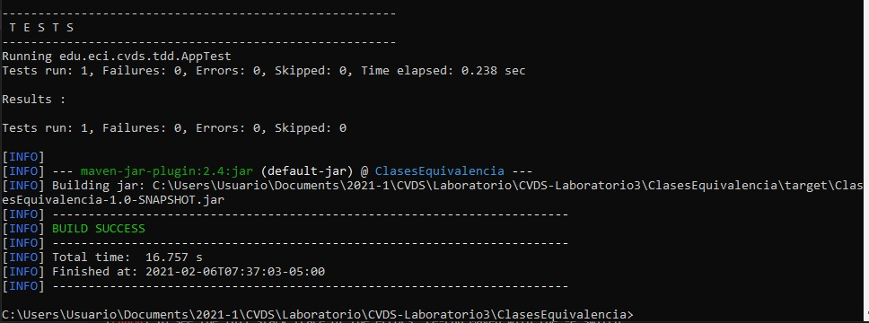
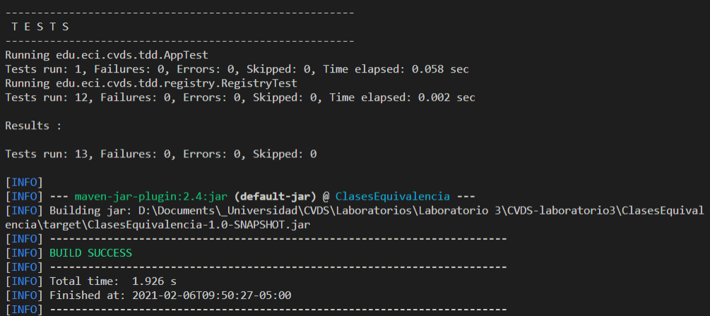

# Ciclos de vida y desarrollo de software - Laboratorio 3

# CLASES DE EQUIVALENCIA

## CREAR UN PROYECTO CON MAVEN

- Creamos un nuevo proyecto basado en un arquetipo con la siguiente configuracion:
 - Grupo: edu.eci.cvds
 - Artefacto: ClasesEquivalencia
 - Paquete: edu.eci.cvds.tdd
 - archetypeArtifactId: maven-archetype-quickstart

### **Actualizar y crear dependencias en el proyecto**

Cambiamos nuestra version del compilador de Java a la version 8

```
    <properties>
        <maven.compiler.target>1.8</maven.compiler.target>
        <maven.compiler.source>1.8</maven.compiler.source>
    </properties>
```

### COMPILAR Y EJECUTAR

- Ejecutamos el proyecto utilizando el comando:

```
mvn package
```

- Y para correr los Test Unitarios

```
mvn surefire:test
```




### EJECRICIO "REGISTRADURIA"
Crearemos un proyecto base para un requirimiento de la registraduria en el cual
se registraran personas con intencion de votar para las proximas elecciones y 
se generaran los certificados electorales de aquellas personas cuyo voto sea valido.

### PROPIEDADES

- Solo se reistraran votantes validos
- Solo se permite una inscripcion por numero de documento

### FINALIZAR EL EJERCICIO

- Casos de equivalencia:
 - Verificar que el usuario este vivo:
```
Person p = new Person();
p.setAlive(false);
Registry result = new Registry();
assertEquals(RegistryResult.DEAD, result.registervoter(p));
```
 - Verificar que el usuario este vivo y sea menor de edad:
```
Person p = new Person();
p.setAge(10);
p.setAlive(true);
Registry result = new Registry();
assertEquals(RegistryResult.UNDERAGE, result.registerVoter(p));
```
 - Verificar que la edad sea invalida (menor a cero, mayor que 125):
```
Person p = new Person();
p.setAge(-1);
Registry result = new Registrty();
assertEquals(RegistryResult.INVALID_AGE, result.registerVoter(p));
```

```
Person p = new Person();
p.setAge(126);
Registry result = new Registrty();
assertEquals(RegistryResult.INVALID_AGE, result.registerVoter(p));
```

```
Person p = new Person();
p.setAge(0);
Registry result = new Registrty();
assertEquals(RegistryResult.INVALID_AGE, result.registerVoter(p));
```

```
Person p = new Person();
p.setAge(1231246);
Registry result = new Registrty();
assertEquals(RegistryResult.INVALID_AGE, result.registerVoter(p));
```

 - Verificar que la identificación es invalida (menor a cero, logitud mayor a 13 digitos):
```
Person p = new Person();
p.setId(-1234);
Registry result = new Registry();
assertEquals(RegistryResult.INVALID_ID, result.registerVoter(p));
```

Person p = new Person();
p.setId(12345678912346);
Registry result = new Registry();
assertEquals(RegistryResult.INVALID_ID, result.registerVoter(p));
```

Person p = new Person();
p.setId(-1234523542326);
Registry result = new Registry();
assertEquals(RegistryResult.INVALID_ID, result.registerVoter(p));
```

 - Verificar que el documento esté duplicado
```
Person p1,p2 = new Person(), new Person();
p1.setId(123);
p2.setId(123);
RegistryResult result = new Registry();
result.registerVoter(p1);
assertEquals(RegistryResult.DUPLICATED, result.registerVoter(p2));
```

Y vemos el resultado de las pruebas correctamente


### **EJERCICIO "DESCUENTO DE TARIFAS"**
### REALIZAR DISEÑO DE PRUEBAS

```
calcular la tarifa de cada billete según el trayecto, la antelación
en la que se obtiene el billete y la edad del pasajero, de acuerdo
con la normativa 005.
@param tarifaBase valor base del vuelo
@param diasAntelacion dias de antelación del vuelo
@param edad - edad del pasajero
@throws ExcepcionParametrosInvalidos [XXXXXXXXXXXXXXXXXXXXXXXXXXX]

public long calculoTarifa(long tarifaBase, int diasAntelacion, int edad)
```

### Clases de equivalencia

| Número | Clase de equivalencia | Resultado |
| ------|-----|-----|
| 1 | Verificar que la tarifa base sea invalida | incorrecto |
| 2 | Verificar que los dias de antelacion sean invalidos | incorrecto |
| 3 | Verificar que la edad sea invalida | incorrecto	|

### Casos de prueba por clases de equivalencia
- Verificar que la tarifa base sea invalida
	- Parametros: 
		- tarifaBase = -10000
		- diasAntelacion = 0
		- edad = 50
	- Resultado esperado:
		- ExcepcionParametrosInvalidos [tarifaBase]

- Verificar que los dias de antelacion sean invalidos
	- Parametros: 
		- tarifaBase = 250000
		- diasAntelacion = -10
		- edad = 50
	- Resultado esperado:
		- ExcepcionParametrosInvalidos [diasAntelacion]

- Verificar que la edad sea invalida
	- Parametros: 
		- tarifaBase = 250000
		- diasAntelacion = 5
		- edad = -10
	- Resultado esperado:
		- ExcepcionParametrosInvalidos [edad]

### Limite o fronteras

- tarifaBase = [35000, 55000000]
- diasAntelacion = {0, 20, 365}
- edad = [0, 125]

### Casos de prueba
- Verificar que la tarifa base sea invalida (menor o igual que 0, mayor que 55 millones)
	- tarifaBase <= 0 
	- tarifaBase >= 56000000 
	- tarifaBase == -1 
	- tarifaBase == 56M
- Verificar que los dias de antelacion sean invalidos (dias negativos, mas dias de los que tra el año)
	- diasAntelacion == -1 
	- diasAntelacion == -365 
	- diasAntelacion == 366 (no biciesto) 
	- diasAntelacion == 1000
- Verificar que la edad sea invalida
	- edad == -10
	- edad == 0
	- edad == 126
	- edad == 1000